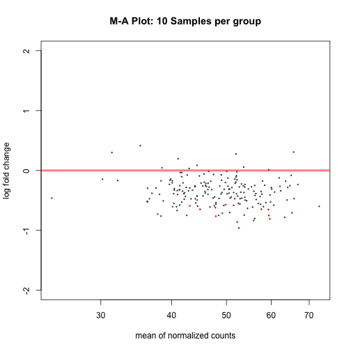
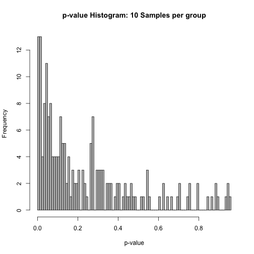
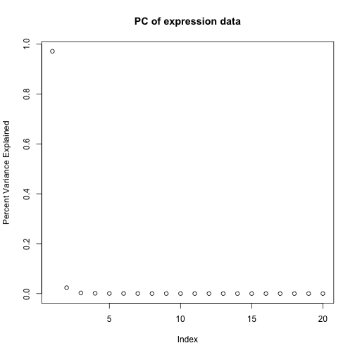

One of the most common applications of RNA sequencing technology is to identify genes that are differentially expressed between sample groups, for example, between wild type and mutant, or between tumor and normal samples. Count data report the number of sequence reads (fragments) assigned to each gene, which describes the expression abundance of a gene. Similar data can be found in ChIP-Seq, HiC, shRNA screening, or mass spectrometry experiments.

Once we have aligned sequence reads and have quantified expression, we can continue the pipeline with differential expression analysis. We will use read counts at the gene level and the R package [DESeq2](http://bioconductor.org/packages/release/bioc/html/DESeq2.html). 

R Libraries and Data Import
------------------------------------
Load the R libraries.

~~~
library("DESeq2")
library(ggplot2)
library(dplyr)
getwd()
~~~
{: .r}

~~~
[1] "/Users/smc/Projects/Lessons/ngs-lesson/_episodes_rmd"
~~~
{: .output}

Load the data files.

~~~
# Load raw read counts.
load("../data/DO192_RNAseq_EMASE_RawCounts.Rdata")

# Load covariates & annotations.
load("../data/ChickMungeretal2016_DiversityOutbred.Rdata")

# a quick look at the expression data
dim(expr.rna.192.rawcounts)
~~~
{: .r}

~~~
[1]   192 21122
~~~
{: .output}

~~~
names(expr.rna.192.rawcounts)
~~~
{: .r}

~~~
NULL
~~~
{: .output}

~~~
expr.rna.192.rawcounts[1:5, 1:5]
~~~
{: .r}

~~~
     ENSMUSG00000051951 ENSMUSG00000025902 ENSMUSG00000098104
F326                  0                 40           1.037443
F327                  0                 19           1.022762
F328                  2                 45           1.016287
F329                  0                 24           0.000000
F330                  2                 41           1.060340
     ENSMUSG00000033845 ENSMUSG00000025903
F326           844.0000           2162.105
F327           522.0000           2387.839
F328           840.0000           2805.040
F329           799.9814           2683.853
F330           840.9969           2780.843
~~~
{: .output}

The raw read counts have 192 rows and 21122 columns, with animal IDs for row names and Ensembl gene IDs for column names. The first five rows and five columns are shown above.

Create a data frame containing key experimental design factors for this experiment. These factors include diet and sex.

~~~
exp_design <- data.frame(
  mouseIDs = rownames(expr.rna.192.rawcounts),
  diet = covariates.rna.192$Diet,
  sex = covariates.rna.192$Sex,
  coat_color = covariates.rna.192$Coat.Color)
head(exp_design)
~~~
{: .r}

~~~
  mouseIDs diet sex coat_color
1     F326 chow   F      black
2     F327 chow   F      black
3     F328 chow   F      white
4     F329 chow   F     agouti
5     F330 chow   F     agouti
6     F331 chow   F      black
~~~
{: .output}

Check to make sure that all mouse IDs are represented in the raw read counts and in the experimental design file.  

~~~
all(rownames(expr.rna.192.rawcounts)==exp_design$mouseIDs)
~~~
{: .r}

~~~
[1] TRUE
~~~
{: .output}

A quick check for sample mixup
------------------------------
Let's do a quick check for sample mixup with *Xist* gene expression. *Xist*, or X-inactive specific transcript, produces non-protein coding RNA. The gene is expressed exclusively from the inactivated X chromosome in female mice.  

~~~
geneID <- "ENSMUSG00000086503"
geneName <- "Xist"
gIndex <- which(colnames(expr.rna.192.rawcounts)==geneID)
data <- data.frame(exp_design,
                   exp=as.numeric(expr.rna.192.rawcounts[,gIndex]))
~~~
{: .r}

Plot **Xist** expression in all samples against sex.   

~~~
p <- ggplot(data, aes(x = sex, y = exp)) 
p <- p + geom_point(position = position_jitter(width = 0.1), 
                    size = 3, aes(colour = sex))
p <- p + stat_summary(fun.y = mean, geom = "point")
p <- p + ylab(label = "Gene Expression (Read Counts)")
p <- p + ggtitle(label = "Xist", subtitle = "ENSMUSG00000086503")
p
~~~
{: .r}

Female mice averaged 15,000 raw read counts for *Xist*, while males had none. We can rest assured that male and female samples weren't mixed up.

We'll start with an example identifying the genes that are differentially expressed in the samples between two diets **Chow** and **High fat**.

~~~
male_index = which(exp_design$sex=="M")
female_index = which(exp_design$sex=="F")
chow_index= which(exp_design$diet=="chow")
hf_index= which(exp_design$diet=="HF")
male_chow = intersect(male_index, chow_index)
male_hf = intersect(male_index, hf_index)
~~~
{: .r}

Differential Expression Analysis with **three** samples in each group
------------------------------------------------------------------
To make the example simple, we'll subset the expression data such that we have **3 DO mice** under **Chow diet** and 3 DO mice under **High Fat diet**.  

~~~
sampleSize = 3
~~~
{: .r}

Later on we will see the effect of sample size by varying it.  

~~~
diet_DE <- c(male_chow[1:sampleSize], male_hf[1:sampleSize])
exp_design_diet_DE <- exp_design[diet_DE,]
exp_design_diet_DE
~~~
{: .r}

~~~
    mouseIDs diet sex coat_color
99      M326 chow   M      black
100     M327 chow   M     agouti
101     M328 chow   M     agouti
122     M351   HF   M      black
123     M352   HF   M      black
124     M353   HF   M     agouti
~~~
{: .output}

~~~
exp_diet_DE <- expr.rna.192.rawcounts[diet_DE,]
all(rownames(exp_diet_DE) == as.vector(exp_design_diet_DE$mouseIDs))
~~~
{: .r}

~~~
[1] TRUE
~~~
{: .output}

~~~
exp_diet_DE[, 1:5]
~~~
{: .r}

~~~
     ENSMUSG00000051951 ENSMUSG00000025902 ENSMUSG00000098104
M326                  2                 28           0.000000
M327                  0                 30           1.025781
M328                  0                 22           0.000000
M351                  1                 29           0.000000
M352                  1                 29           0.000000
M353                  1                 40           0.000000
     ENSMUSG00000033845 ENSMUSG00000025903
M326           705.0000           2637.273
M327           634.0064           2587.214
M328           630.0000           2470.107
M351           455.9880           1734.103
M352           493.0000           2078.551
M353           570.9945           2393.521
~~~
{: .output}

Filter out genes with zero and low expression (fewer than 5 read counts) in 50% of the samples.

~~~
thres <- 5
nzIndex <- as.vector(which(apply(exp_diet_DE, 1, function(x){sum(x>thres)/length(x)})>=0.5))
head(nzIndex)
~~~
{: .r}

~~~
[1] 1 2 3 4 5 6
~~~
{: .output}

~~~
exp.dietDE = exp_diet_DE[nzIndex,]
dim(exp.dietDE)
~~~
{: .r}

~~~
[1]     6 21122
~~~
{: .output}

Create data frames for **DESeq2** object.  

~~~
### colData contains the condition/group information for Differenetial expression analysis
colData <- DataFrame(group = factor(exp_design_diet_DE$diet))
~~~
{: .r}

~~~
### Create DESeq2 object using expression and colData
dds <- DESeqDataSetFromMatrix(countData = as.data.frame(round(exp.dietDE)),
         colData = colData, design = ~ group)
~~~
{: .r}

~~~
Error: ncol(countData) == nrow(colData) is not TRUE
~~~
{: .error}

~~~
dds <- DESeq(dds)
~~~
{: .r}

~~~
Error in is(object, "DESeqDataSet"): object 'dds' not found
~~~
{: .error}

~~~
res = results(dds)
~~~
{: .r}

~~~
Error in mcols(object): object 'dds' not found
~~~
{: .error}

~~~
### summary of Differential Expression analysis
summary(res)
~~~
{: .r}

~~~
Error in summary(res): object 'res' not found
~~~
{: .error}

~~~
plotMA(res, main="M-A Plot: 3 Samples per group", ylim=c(-2,2))
~~~
{: .r}

~~~
Error in plotMA(res, main = "M-A Plot: 3 Samples per group", ylim = c(-2, : object 'res' not found
~~~
{: .error}

~~~
d<-plotCounts(dds, gene=which.min(res$padj), intgroup="group",
              returnData=TRUE)
~~~
{: .r}

~~~
Error in which.min(res$padj): object 'res' not found
~~~
{: .error}

~~~
p <- ggplot(d, aes(x=group, y=count)) +
  geom_point(position=position_jitter(w=0.2,h=0),size=3)
~~~
{: .r}

~~~
Error in ggplot(d, aes(x = group, y = count)): object 'd' not found
~~~
{: .error}

~~~
p <- p + theme(axis.text=element_text(size=12),
               axis.title=element_text(size=20,face="bold", colour = "blue"),
               plot.title = element_text(size = rel(2)))
p
~~~
{: .r}

Let us plot the histogram of p-values. The p-value histogram is a good diagnostic test for the differential expression analysis.

~~~
hist(res$pvalue,breaks=100,col="grey", xlab="p-value",main="p-value histogram: 3 Samples per group")
~~~
{: .r}

~~~
Error in hist(res$pvalue, breaks = 100, col = "grey", xlab = "p-value", : object 'res' not found
~~~
{: .error}

Differential Expression Analysis with **ten** samples in each **diet** group
------------------------------------------------------------------

~~~
sampleSize = 10
~~~
{: .r}
Later on we will see the effect of sample size by varying it.

~~~
diet_DE = c(male_chow[1:sampleSize],male_hf[1:sampleSize])
exp_design_diet_DE= exp_design[diet_DE,]
exp_design_diet_DE
exp_diet_DE=expr.rna.192.rawcounts[,diet_DE]
all(colnames(exp_diet_DE)==as.vector(exp_design_diet_DE$mouseIDs))
head(exp_diet_DE)
~~~
{: .r}

~~~
head(exp_diet_DE)
~~~
{: .r}

~~~
     ENSMUSG00000026134 ENSMUSG00000004768 ENSMUSG00000042215
F326                 39                 35            7.00000
F327                 32                157           14.00000
F328                 32                 82           25.00000
F329                 58                146           13.00000
F330                 53                110           13.00084
F331                 41                193           42.00000
     ENSMUSG00000042197 ENSMUSG00000081402 ENSMUSG00000042182
F326           215.8077             0.0000           4.000001
F327           219.0097             0.0000           6.011896
F328           250.2053             0.0000           8.999999
F329           270.0494             0.0000          10.000000
F330           207.7895             0.0000           2.000000
F331           259.7004             1.1645           9.000000
     ENSMUSG00000026131 ENSMUSG00000096992 ENSMUSG00000042111
F326           1873.282                  0                172
F327           1136.616                  0                121
F328           1990.669                  0                203
F329           1329.857                  0                119
F330           1806.600                  1                162
F331           2011.512                  0                122
     ENSMUSG00000026127 ENSMUSG00000001138 ENSMUSG00000067653
F326                317           290.9783                 37
F327                268           271.6315                 25
F328                419           284.0689                 31
F329                361           268.6716                 30
F330                411           300.6735                 18
F331                367           339.1893                 34
     ENSMUSG00000079610 ENSMUSG00000026121 ENSMUSG00000087589
F326                 35                 97                  0
F327                 39                 63                  0
F328                 35                 86                  0
F329                 39                 71                  0
F330                 35                 72                  0
F331                 32                 47                  0
     ENSMUSG00000046337 ENSMUSG00000061518 ENSMUSG00000037351
F326                  0          1439.9999                601
F327                  0          1265.7777                578
F328                  0          1678.0000                822
F329                  0           975.9786                662
F330                  1          1722.8106                692
F331                  1          1568.9997                746
     ENSMUSG00000026117 ENSMUSG00000026116
F326                152                552
F327                105                503
F328                133                576
F329                164                549
F330                204                623
F331                184                572
~~~
{: .output}

Let us filter out genes with zero and low expression (less than 5 read counts) in 50% of the samples.

~~~
thres= 5
nzIndex= as.vector(which(apply(exp_diet_DE,1,function(x){sum(x>thres)/length(x)})>=0.5))
head(nzIndex)
exp.dietDE = exp_diet_DE[nzIndex,]
dim(exp.dietDE)
~~~
{: .r}
Let us create data frames for DESeq2 object

~~~
### colData contains the condition/group information for Differenetial expression analysis
colData <- DataFrame(group = factor(exp_design_diet_DE$diet))
~~~
{: .r}

~~~
### Create DESeq2 object using expression and colData
dds <- DESeqDataSetFromMatrix(countData = as.data.frame(round(exp.dietDE)),
         colData = colData, design = ~ group)
~~~
{: .r}

~~~
converting counts to integer mode
~~~
{: .output}

~~~
dds <- DESeq(dds)
~~~
{: .r}

~~~
estimating size factors
~~~
{: .output}

~~~
estimating dispersions
~~~
{: .output}

~~~
gene-wise dispersion estimates
~~~
{: .output}

~~~
mean-dispersion relationship
~~~
{: .output}

~~~
-- note: fitType='parametric', but the dispersion trend was not well captured by the
   function: y = a/x + b, and a local regression fit was automatically substituted.
   specify fitType='local' or 'mean' to avoid this message next time.
~~~
{: .output}

~~~
final dispersion estimates
~~~
{: .output}

~~~
fitting model and testing
~~~
{: .output}

~~~
res = results(dds)
~~~
{: .r}

~~~
### summary of Differential Expression analysis
summary(res)
~~~
{: .r}

~~~
plotMA(res, main="M-A Plot: 10 Samples per group", ylim=c(-2,2))
~~~
{: .r}

~~~
d<-plotCounts(dds, gene=which.min(res$padj), intgroup="group",
              returnData=TRUE)
p <- ggplot(d, aes(x=group, y=count)) +
  geom_point(position=position_jitter(w=0.2,h=0),size=3)
p <- p + theme(axis.text=element_text(size=12),
               axis.title=element_text(size=20,face="bold", colour = "blue"),
               plot.title = element_text(size = rel(2)))
p
~~~
{: .r}

~~~
hist(res$pvalue,breaks=100,col="grey", xlab="p-value",main="p-value Histogram: 10 Samples per group")
~~~
{: .r}

~~~
svd.obj = svd(apply(exp.dietDE,1,function(x){x-mean(x)}))
plot(svd.obj$d^2/sum(svd.obj$d^2),ylab="Percent Variance Explained", main="PC of expression data")
~~~
{: .r}

~~~
print(cor(svd.obj$u[,1],as.numeric(as.factor(exp_design_diet_DE$diet))))
print(cor(svd.obj$u[,2],as.numeric(as.factor(exp_design_diet_DE$diet))))
print(cor(svd.obj$u[,5],as.numeric(as.factor(exp_design_diet_DE$diet))))
print(cor(svd.obj$u[,1],
    as.numeric(as.factor(covariates.rna.192$Coat.Color[diet_DE]))))
print(cor(as.numeric(as.factor(exp_design_diet_DE$diet)),
                         as.numeric(as.factor(covariates.rna.192$Coat.Color[diet_DE]))))
~~~
{: .r}
