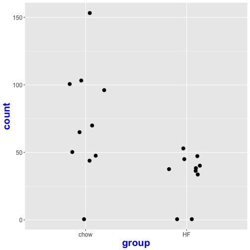

One of the most common applications of RNA sequencing technology is to identify genes that are differentially expressed between sample groups, for example, between wild type and mutant, or between tumor and normal samples. Count data report the number of sequence reads (fragments) assigned to each gene, which describes the expression abundance of a gene. Similar data can be found in ChIP-Seq, HiC, shRNA screening, or mass spectrometry experiments.

Once we have aligned sequence reads and have quantified read counts, we can continue the pipeline with differential expression analysis. We will use read counts at the gene level and the R package [DESeq2](http://bioconductor.org/packages/release/bioc/html/DESeq2.html). 

R Libraries and Data Import
------------------------------------
Load the R packages and libraries.

Load the data file from the URL. See the documentation for *gzcon* for an explanation of uncompressing a zipped (.gz) file through a connection, in this case, a URL.

Check the expression data and make it a matrix.

Let us create data frame containing key experimental design factors for the experiment.

~~~
exp_design = data.frame(mouseIDs=colnames(exp.all),
                        diet=covariates.rna.192$Diet,
                        sex=covariates.rna.192$Sex,
                        coat_color=covariates.rna.192$Coat.Color)
~~~
{: .r}

~~~
Error in colnames(exp.all): object 'exp.all' not found
~~~
{: .error}

~~~
all(colnames(exp.all)==exp_design$mouseIDs)
~~~
{: .r}

~~~
Error in colnames(exp.all): object 'exp.all' not found
~~~
{: .error}

A quick check for sample mixup
------------------------------
Let us do a quick sample mixup check using **Xist** gene expression. Xist is non-coding RNA 

~~~
geneID="ENSMUSG00000086503"
geneName="Xist"
gIndex = which(rownames(exp.all)==geneID)
~~~
{: .r}

~~~
Error in rownames(exp.all): object 'exp.all' not found
~~~
{: .error}

~~~
data= data.frame(exp_design, 
                 exp=as.numeric(exp.all[gIndex,]))
~~~
{: .r}

~~~
Error in data.frame(exp_design, exp = as.numeric(exp.all[gIndex, ])): object 'exp_design' not found
~~~
{: .error}

~~~
head(data)
~~~
{: .r}

~~~
                      F326    F327    F328    F329    F330    F331    F332
ENSMUSG00000090025  0.0145  0.0000  0.0667  0.0149  0.0000  0.0000  0.0000
ENSMUSG00000051951  0.0000  0.0000  0.0267  0.0000  0.0129  0.0000  0.0000
ENSMUSG00000025902  0.4928  0.2930  0.5067  0.3134  0.4133  0.5714  0.4308
ENSMUSG00000098104  0.0145  0.0000  0.0133  0.0000  0.0000  0.0000  0.0000
ENSMUSG00000033845 11.3478  8.2895 10.5467 11.0448 10.0226 10.8254 13.2308
ENSMUSG00000025903 30.5449 40.2154 36.7133 39.1090 35.1088 38.0063 40.4769
                      F333    F334    F335    F336    F337    F338    F339
ENSMUSG00000090025  0.0500  0.0317  0.0145  0.0156  0.0947  0.0147  0.0000
ENSMUSG00000051951  0.0333  0.0159  0.0000  0.0000  0.0133  0.0294  0.0312
ENSMUSG00000025902  0.5000  0.4286  0.4058  0.5312  0.4667  0.4559  0.2656
ENSMUSG00000098104  0.0000  0.0000  0.0000  0.0156  0.0000  0.0000  0.0000
ENSMUSG00000033845 10.2167 11.2381 10.7101  8.8438  9.6133 10.3824  9.3125
ENSMUSG00000025903 37.7417 39.7254 41.5710 33.0094 39.5080 36.9750 35.5359
                      F340    F341    F342    F343    F344    F345    F346
ENSMUSG00000090025  0.0000  0.0343  0.0000  0.0156  0.0000  0.0175  0.0531
ENSMUSG00000051951  0.0000  0.0000  0.0182  0.0312  0.0000  0.0000  0.0156
ENSMUSG00000025902  0.3953  0.4460  0.3091  0.6094  0.3854  0.3333  0.2031
ENSMUSG00000098104  0.0000  0.0000  0.0000  0.0000  0.0138  0.0000  0.0000
ENSMUSG00000033845 10.5771  9.7942  9.0909  9.9062  9.1810 12.0702 11.2656
ENSMUSG00000025903 38.2672 36.2882 33.1309 37.5641 33.7151 39.3561 39.4375
                      F347    F348    F349    F350    F351    F352    F353
ENSMUSG00000090025  0.0235  0.0128  0.0000  0.0000  0.0000  0.0871  0.0000
ENSMUSG00000051951  0.0235  0.0512  0.0118  0.0000  0.0000  0.0286  0.0000
ENSMUSG00000025902  0.2941  0.3844  0.2235  0.3130  0.5000  0.4857  0.4125
ENSMUSG00000098104  0.0000  0.0000  0.0118  0.0000  0.0000  0.0000  0.0000
ENSMUSG00000033845 10.0706 12.1461  9.2679 11.2989 10.2143  9.8571 12.7169
ENSMUSG00000025903 34.6212 41.5605 29.2726 41.1049 35.6988 37.7700 38.2831
                      F354    F355    F356    F357    F358    F359    F360
ENSMUSG00000090025  0.0026  0.0616  0.0212  0.0000  0.0188  0.0294  0.0135
ENSMUSG00000051951  0.0000  0.0137  0.0000  0.0000  0.0145  0.0147  0.0000
ENSMUSG00000025902  0.3553  0.3562  0.4870  0.4260  0.2609  0.4706  0.1756
ENSMUSG00000098104  0.0132  0.0137  0.0000  0.0000  0.0000  0.0000  0.0000
ENSMUSG00000033845 11.1579  9.7808 15.6485 10.2548 10.7246  9.8382 11.0098
ENSMUSG00000025903 34.0855 39.5685 42.0921 29.8684 30.6203 34.1544 36.5214
                      F361    F362    F363    F364    F365    F366    F367
ENSMUSG00000090025  0.0000  0.0172  0.0716  0.0000  0.0188  0.0000  0.0000
ENSMUSG00000051951  0.0122  0.0172  0.0179  0.0000  0.0188  0.0000  0.0116
ENSMUSG00000025902  0.3902  0.5170  0.6082  0.4030  0.4520  0.2875  0.4186
ENSMUSG00000098104  0.0000  0.0000  0.0000  0.0149  0.0000  0.0000  0.0000
ENSMUSG00000033845  6.6951 10.3404 13.7925 12.6119  8.6441 10.8000 11.3953
ENSMUSG00000025903 27.5963 36.3498 39.3506 35.2761 29.9812 33.9400 33.0384
                      F368    F369    F371    F372    F373    F374    F375
ENSMUSG00000090025  0.0154  0.0000  0.0000  0.1176  0.0000  0.0153  0.0877
ENSMUSG00000051951  0.0000  0.0000  0.0000  0.0000  0.0139  0.0153  0.0137
ENSMUSG00000025902  0.1846  0.3429  0.4219  0.4324  0.3333  0.5500  0.5479
ENSMUSG00000098104  0.0000  0.0000  0.0000  0.0135  0.0000  0.0000  0.0000
ENSMUSG00000033845  9.7385  9.8571  7.7344  9.0541 10.7500 12.9870 11.2329
ENSMUSG00000025903 34.0477 36.0614 28.2969 28.6757 32.8611 25.0069 40.9918
                      F376    F377    F378    F379    F380    F381    F382
ENSMUSG00000090025  0.0000  0.0143  0.0000  0.0119  0.0000  0.2172  0.0000
ENSMUSG00000051951  0.0000  0.0000  0.0000  0.0000  0.0000  0.0000  0.0441
ENSMUSG00000025902  0.3448  0.5714  0.3143  0.3571  0.5312  0.4483  0.3088
ENSMUSG00000098104  0.0000  0.0000  0.0000  0.0000  0.0000  0.0000  0.0000
ENSMUSG00000033845 11.5690 10.6143 10.7000  8.2619 12.9375 13.8103 12.7059
ENSMUSG00000025903 39.7586 38.8014 35.1114 31.3310 38.5219 41.8103 44.4235
                      F383    F384    F385    F386    F387    F388    F389
ENSMUSG00000090025  0.0145  0.0132  0.0179  0.0885  0.0158  0.0161  0.0000
ENSMUSG00000051951  0.0145  0.0000  0.0000  0.0000  0.0000  0.0322  0.0000
ENSMUSG00000025902  0.6232  0.4211  0.2836  0.3770  0.4096  0.3218  0.4795
ENSMUSG00000098104  0.0145  0.0132  0.0149  0.0164  0.0000  0.0000  0.0000
ENSMUSG00000033845  8.7826  9.6316  9.3731  9.5246  9.8464 10.9895  8.8630
ENSMUSG00000025903 28.6478 35.1303 34.7149 36.5492 32.4947 38.1126 31.0877
                      F390    F391    F392    F393    F394    F395    F396
ENSMUSG00000090025  0.0000  0.0224  0.0000  0.0000  0.0000  0.0000  0.0172
ENSMUSG00000051951  0.0000  0.0000  0.0000  0.0319  0.0000  0.0000  0.0132
ENSMUSG00000025902  0.3387  0.4737  0.3571  0.4625  0.5690  0.6182  0.3836
ENSMUSG00000098104  0.0000  0.0000  0.0000  0.0000  0.0000  0.0000  0.0000
ENSMUSG00000033845 10.1599  9.1974 12.1250  9.8884 10.4483 11.2364  9.0873
ENSMUSG00000025903 35.2110 36.3697 42.3375 34.5327 36.2052 35.6109 33.5556
                      F397    F398    F399    F400    F401    F402    F403
ENSMUSG00000090025  0.0295  0.0000  0.0000  0.0984  0.0154  0.0000  0.0238
ENSMUSG00000051951  0.0128  0.0286  0.0000  0.0000  0.0000  0.0000  0.0317
ENSMUSG00000025902  0.6154  0.3429  0.6566  0.4918  0.5385  0.2500  0.3810
ENSMUSG00000098104  0.0000  0.0143  0.0000  0.0000  0.0000  0.0000  0.0000
ENSMUSG00000033845 11.0000 13.3000  9.2424 11.1967 10.3385  9.6618 11.0476
ENSMUSG00000025903 34.8321 49.1171 38.0236 39.7607 35.8523 30.6176 38.1921
                      F405    F406    F407    F408    F409    F410    F411
ENSMUSG00000090025  0.0000  0.0144  0.0266  0.0000  0.0000  0.0000  0.0149
ENSMUSG00000051951  0.0000  0.0000  0.0000  0.0000  0.0541  0.0276  0.0000
ENSMUSG00000025902  0.4886  0.3878  0.6123  0.3444  0.6216  0.1794  0.5496
ENSMUSG00000098104  0.0114  0.0000  0.0133  0.0000  0.0135  0.0000  0.0297
ENSMUSG00000033845  9.2614  7.5978  9.5707 13.5025  7.9730 10.9693 13.7542
ENSMUSG00000025903 34.9989 29.9935 39.9547 52.1432 32.3392 38.4326 29.7364
                      F412    F413    F414    F415    F416    F417    F418
ENSMUSG00000090025  0.0132  0.0000  0.0000  0.0149  0.0000  0.0173  0.0116
ENSMUSG00000051951  0.0395  0.0357  0.0130  0.0000  0.0000  0.0000  0.0000
ENSMUSG00000025902  0.3158  0.2321  0.3766  0.3284  0.3303  0.3457  0.2674
ENSMUSG00000098104  0.0000  0.0000  0.0000  0.0000  0.0000  0.0000  0.0000
ENSMUSG00000033845  8.6974 10.9107 10.2597 10.8209  6.7635 12.1694  9.7326
ENSMUSG00000025903 21.8013 31.5661 27.8286 35.1403 25.8111 40.1798 28.8291
                      F419    F420    F421    F422    F423    F424    F425
ENSMUSG00000090025  0.0760  0.0000  0.0000  0.0000  0.0328  0.0294  0.0226
ENSMUSG00000051951  0.0133  0.0000  0.0123  0.0000  0.0164  0.0294  0.0161
ENSMUSG00000025902  0.2933  0.3538  0.3086  0.6571  0.4262  0.6029  0.7097
ENSMUSG00000098104  0.0000  0.0000  0.0123  0.0000  0.0000  0.0000  0.0000
ENSMUSG00000033845 11.0400  9.8615 11.3086  8.8714 11.3279 13.6471  9.2097
ENSMUSG00000025903 30.2187 32.1954 33.1086 33.7743 39.1885 45.2971 35.2435
                      M326    M327    M328    M329    M330    M331    M332
ENSMUSG00000090025  0.0000  0.0152  0.0000  0.0172  0.0164  0.0621  0.0000
ENSMUSG00000051951  0.0333  0.0000  0.0000  0.0000  0.0000  0.0000  0.0000
ENSMUSG00000025902  0.3167  0.3030  0.2545  0.2931  0.3113  0.5590  0.4837
ENSMUSG00000098104  0.0000  0.0000  0.0000  0.0000  0.0000  0.0000  0.0000
ENSMUSG00000033845 10.6833  8.7273 10.5818 10.1552 10.3073 10.0155  9.7219
ENSMUSG00000025903 43.3733 38.7758 43.8200 45.8345 35.9623 42.3929 36.8077
                      M333    M334    M335    M336    M337    M339    M340
ENSMUSG00000090025  0.0222  0.0000  0.1161  0.0434  0.0000  0.0060  0.0000
ENSMUSG00000051951  0.0000  0.0000  0.0000  0.0000  0.0000  0.0299  0.0175
ENSMUSG00000025902  0.4889  0.4143  0.3871  0.2385  0.2500  0.3881  0.3158
ENSMUSG00000098104  0.0000  0.0000  0.0000  0.0000  0.0000  0.0000  0.0000
ENSMUSG00000033845  9.6444  9.0714  8.8226  8.6504 10.0893 11.3582 12.4561
ENSMUSG00000025903 42.1822 34.4086 40.9855 42.3675 40.4357 42.5030 44.2719
                      M341    M342   M343    M344    M345    M347    M348
ENSMUSG00000090025  0.0000  0.0000  0.000  0.0000  0.0000  0.0000  0.0000
ENSMUSG00000051951  0.0000  0.0000  0.020  0.0000  0.0000  0.0175  0.0000
ENSMUSG00000025902  0.2985  0.4500  0.360  0.2011  0.3051  0.2792  0.5192
ENSMUSG00000098104  0.0149  0.0000  0.000  0.0000  0.0000  0.0000  0.0000
ENSMUSG00000033845 10.4478 12.7167 11.320  8.5009 10.7797 13.4206  7.6154
ENSMUSG00000025903 40.3194 44.3833 50.344 41.5320 44.3102 38.3211 34.4577
                      M349    M350   M351    M352    M353    M354    M355
ENSMUSG00000090025  0.0000  0.0296  0.000  0.0182  0.0229  0.0000  0.0000
ENSMUSG00000051951  0.0182  0.0174  0.000  0.0182  0.0000  0.0000  0.0182
ENSMUSG00000025902  0.2909  0.2962  0.460  0.4545  0.4571  0.3684  0.5636
ENSMUSG00000098104  0.0000  0.0000  0.000  0.0000  0.0000  0.0000  0.0000
ENSMUSG00000033845 10.3091  9.8432  8.520  8.0364  7.5857  9.1842 10.4182
ENSMUSG00000025903 36.7473 38.8153 33.914 37.5818 33.2057 43.9763 43.1727
                      M356    M357    M358    M359    M360    M361    M362
ENSMUSG00000090025  0.0000  0.0000  0.0351  0.0017  0.0000  0.0176  0.0000
ENSMUSG00000051951  0.0147  0.0130  0.0000  0.0000  0.0202  0.0000  0.0000
ENSMUSG00000025902  0.3529  0.4026  0.2459  0.4264  0.4038  0.3351  0.2639
ENSMUSG00000098104  0.0000  0.0000  0.0000  0.0000  0.0000  0.0000  0.0000
ENSMUSG00000033845  9.3971  6.5065  7.3430  9.0235  8.5815  8.3245  9.3194
ENSMUSG00000025903 38.9559 34.5026 39.1866 39.0226 38.3362 35.5926 34.9417
                      M363    M364    M365    M366    M367    M368    M369
ENSMUSG00000090025  0.0702  0.0291  0.0000  0.0274  0.0000  0.0299  0.0161
ENSMUSG00000051951  0.0000  0.0182  0.0328  0.0274  0.0000  0.0000  0.0000
ENSMUSG00000025902  0.1404  0.2908  0.3443  0.4795  0.3721  0.1940  0.2902
ENSMUSG00000098104  0.0000  0.0182  0.0000  0.0000  0.0000  0.0149  0.0000
ENSMUSG00000033845  9.0351  9.7229  8.2131  9.7534  6.6977  8.2687  8.7545
ENSMUSG00000025903 38.6000 39.0495 36.5164 38.6575 27.3640 33.4119 42.1524
                      M370   M371    M372    M373    M374    M375    M376
ENSMUSG00000090025  0.0000  0.000  0.0319  0.0000  0.0000  0.0317  0.0000
ENSMUSG00000051951  0.0000  0.000  0.0000  0.0132  0.0308  0.0159  0.0000
ENSMUSG00000025902  0.2994  0.300  0.2683  0.2632  0.5383  0.5556  0.2692
ENSMUSG00000098104  0.0000  0.000  0.0000  0.0000  0.0000  0.0000  0.0000
ENSMUSG00000033845  9.1975 10.740 13.4004  7.8026  8.3968 13.0635 10.5000
ENSMUSG00000025903 48.2378 38.644 36.0755 31.5329 36.8304 39.0222 42.0788
                      M377    M378    M379    M380    M381    M382    M383
ENSMUSG00000090025  0.0000  0.0196  0.0408  0.0000  0.0000  0.0000  0.0290
ENSMUSG00000051951  0.0000  0.0000  0.0000  0.0000  0.0000  0.0385  0.0000
ENSMUSG00000025902  0.5070  0.3333  0.2653  0.3226  0.3235  0.3077  0.4032
ENSMUSG00000098104  0.0000  0.0000  0.0000  0.0161  0.0000  0.0000  0.0000
ENSMUSG00000033845 10.1972  9.1569 13.5306 10.9677 10.0735 11.2692  9.6452
ENSMUSG00000025903 46.0507 45.2059 58.7857 44.0355 31.8088 50.6788 39.7323
                      M384    M385    M386    M387    M388    M389    M390
ENSMUSG00000090025  0.0000  0.0000  0.0085  0.0000  0.0000  0.0000  0.0000
ENSMUSG00000051951  0.0000  0.0179  0.0213  0.0156  0.0000  0.0000  0.0000
ENSMUSG00000025902  0.2467  0.2143  0.2131  0.3431  0.4364  0.4127  0.4639
ENSMUSG00000098104  0.0164  0.0000  0.0000  0.0000  0.0000  0.0000  0.0000
ENSMUSG00000033845 11.2007  9.0179 10.2078 11.9766  9.2000  7.7143  8.6082
ENSMUSG00000025903 40.4539 45.4375 41.4321 37.7575 42.1182 30.0079 39.9313
                      M391    M392    M393    M394    M395    M396    M397
ENSMUSG00000090025  0.0000  0.0000  0.0385  0.0000  0.0203  0.0204  0.0000
ENSMUSG00000051951  0.0000  0.0000  0.0000  0.0000  0.0135  0.0000  0.0196
ENSMUSG00000025902  0.2340  0.2642  0.1843  0.2750  0.3243  0.2245  0.5882
ENSMUSG00000098104  0.0213  0.0000  0.0000  0.0000  0.0000  0.0000  0.0000
ENSMUSG00000033845  9.7447 12.4906 11.8810  9.7750  8.3514  9.0612 10.0588
ENSMUSG00000025903 34.5957 47.9189 32.5966 36.3625 29.4176 46.0224 33.3412
                      M398    M399   M400    M402    M403    M404    M405
ENSMUSG00000090025  0.0319  0.0556  0.000  0.0000  0.0125  0.0000  0.0000
ENSMUSG00000051951  0.0188  0.0000  0.040  0.0159  0.0000  0.0000  0.0119
ENSMUSG00000025902  0.3002  0.3864  0.380  0.1587  0.3500  0.3553  0.2143
ENSMUSG00000098104  0.0000  0.0000  0.020  0.0000  0.0000  0.0000  0.0000
ENSMUSG00000033845 10.9381  8.5781 13.760  9.8889  7.7750  7.7237  8.0238
ENSMUSG00000025903 34.0938 34.1577 49.828 39.9016 33.9925 33.5592 32.9000
                      M406    M407    M408    M409    M410    M411    M415
ENSMUSG00000090025  0.0196  0.0185  0.0339  0.0137  0.0172  0.0000  0.0000
ENSMUSG00000051951  0.0196  0.0000  0.0169  0.0137  0.0000  0.0000  0.0000
ENSMUSG00000025902  0.3922  0.4815  0.4237  0.2603  0.3793  0.4333  0.2083
ENSMUSG00000098104  0.0000  0.0000  0.0000  0.0000  0.0000  0.0000  0.0000
ENSMUSG00000033845  9.1373  7.7963  7.9322  8.0822  8.3103  9.7500  8.0625
ENSMUSG00000025903 30.2961 38.3704 30.8797 35.5342 41.1914 32.4800 33.7708
                      M416    M417    M418    M419    M420    M421    M422
ENSMUSG00000090025  0.0807  0.0519  0.0000  0.0566  0.0000  0.0000  0.0187
ENSMUSG00000051951  0.0000  0.0000  0.0217  0.0000  0.0000  0.0465  0.0000
ENSMUSG00000025902  0.3158  0.5370  0.5000  0.1509  0.2532  0.1707  0.5467
ENSMUSG00000098104  0.0000  0.0000  0.0000  0.0189  0.0000  0.0155  0.0000
ENSMUSG00000033845 10.6491  9.8148  8.5870 12.6226  8.9367  6.4856  9.3467
ENSMUSG00000025903 42.2947 38.6111 33.6717 37.0509 30.1241 31.0954 40.7453
                      M423    M424    M425
ENSMUSG00000090025  0.0179  0.0627  0.0386
ENSMUSG00000051951  0.0000  0.0169  0.0482
ENSMUSG00000025902  0.3036  0.2541  0.4578
ENSMUSG00000098104  0.0000  0.0000  0.0000
ENSMUSG00000033845  8.9464  9.4028  6.1687
ENSMUSG00000025903 35.7786 38.5074 26.1181
~~~
{: .output}

Let us plot **Xist** expression in all samples against sex.

~~~
p <- ggplot(data,aes(x=sex,y=exp)) 
p <- p + geom_point(position = position_jitter(width = 0.1),size=3,
                    aes(colour = factor(sex)))
p <- p + stat_summary(fun.y=mean, geom="point", shape=5, size=4)
p <- p + ylab("Gene Expression (Read Counts)")
p <- p + theme(axis.text=element_text(size=12),
               axis.title=element_text(size=20,face="bold", colour = "blue"),
               plot.title = element_text(size = rel(2)))
p <- p + ggtitle("Xist: ENSMUSG00000086503")
p
~~~
{: .r}

~~~
Don't know how to automatically pick scale for object of type function. Defaulting to continuous.
~~~
{: .output}

~~~
Error in factor(sex): object 'sex' not found
~~~
{: .error}

Let us start with an example identifyingthe genes that are differentially expressed in the samples between two diets **Chow** and **High fat**.

~~~
male_index = which(exp_design$sex=="M")
~~~
{: .r}

~~~
Error in which(exp_design$sex == "M"): object 'exp_design' not found
~~~
{: .error}

~~~
female_index = which(exp_design$sex=="F")
~~~
{: .r}

~~~
Error in which(exp_design$sex == "F"): object 'exp_design' not found
~~~
{: .error}

~~~
chow_index= which(exp_design$diet=="chow")
~~~
{: .r}

~~~
Error in which(exp_design$diet == "chow"): object 'exp_design' not found
~~~
{: .error}

~~~
hf_index= which(exp_design$diet=="HF")
~~~
{: .r}

~~~
Error in which(exp_design$diet == "HF"): object 'exp_design' not found
~~~
{: .error}

~~~
male_chow = intersect(male_index,chow_index)
~~~
{: .r}

~~~
Error in intersect(male_index, chow_index): object 'male_index' not found
~~~
{: .error}

~~~
male_hf = intersect(male_index,hf_index)
~~~
{: .r}

~~~
Error in intersect(male_index, hf_index): object 'male_index' not found
~~~
{: .error}

Differential Expression Analysis with **three** samples in each group
------------------------------------------------------------------
To make the example simple, let us subset our expression data such that we have **3 DO mice** under **Chow diet** and 3 DO mice under **High Fat diet**.

~~~
sampleSize = 3
~~~
{: .r}
Later on we will see the effect of sample size by varying it.

~~~
diet_DE = c(male_chow[1:sampleSize],male_hf[1:sampleSize])
~~~
{: .r}

~~~
Error in eval(expr, envir, enclos): object 'male_chow' not found
~~~
{: .error}

~~~
exp_design_diet_DE= exp_design[diet_DE,]
~~~
{: .r}

~~~
Error in eval(expr, envir, enclos): object 'exp_design' not found
~~~
{: .error}

~~~
exp_design_diet_DE
~~~
{: .r}

~~~
Error in eval(expr, envir, enclos): object 'exp_design_diet_DE' not found
~~~
{: .error}

~~~
exp_diet_DE=exp.all[,diet_DE]
~~~
{: .r}

~~~
Error in eval(expr, envir, enclos): object 'exp.all' not found
~~~
{: .error}

~~~
all(colnames(exp_diet_DE)==as.vector(exp_design_diet_DE$mouseIDs))
~~~
{: .r}

~~~
Error in colnames(exp_diet_DE): object 'exp_diet_DE' not found
~~~
{: .error}

~~~
head(exp_diet_DE)
~~~
{: .r}

~~~
Error in head(exp_diet_DE): object 'exp_diet_DE' not found
~~~
{: .error}

Let us filter out genes with zero and low expression (less than 5 read counts) in 50% of the samples.

~~~
thres= 5
nzIndex= as.vector(which(apply(exp_diet_DE,1,function(x){sum(x>thres)/length(x)})>=0.5))
~~~
{: .r}

~~~
Error in apply(exp_diet_DE, 1, function(x) {: object 'exp_diet_DE' not found
~~~
{: .error}

~~~
head(nzIndex)
~~~
{: .r}

~~~
Error in head(nzIndex): object 'nzIndex' not found
~~~
{: .error}

~~~
exp.dietDE = exp_diet_DE[nzIndex,]
~~~
{: .r}

~~~
Error in eval(expr, envir, enclos): object 'exp_diet_DE' not found
~~~
{: .error}

~~~
dim(exp.dietDE)
~~~
{: .r}

~~~
Error in eval(expr, envir, enclos): object 'exp.dietDE' not found
~~~
{: .error}
Let us create data frames for **DESeq2** object

~~~
### colData contains the condition/group information for Differenetial expression analysis
colData <- DataFrame(group = factor(exp_design_diet_DE$diet))
~~~
{: .r}

~~~
Error in factor(exp_design_diet_DE$diet): object 'exp_design_diet_DE' not found
~~~
{: .error}

~~~
### Create DESeq2 object using expression and colData
dds <- DESeqDataSetFromMatrix(countData = as.data.frame(round(exp.dietDE)),
         colData = colData, design = ~ group)
~~~
{: .r}

~~~
Error in as.data.frame(round(exp.dietDE)): object 'exp.dietDE' not found
~~~
{: .error}

~~~
dds <- DESeq(dds)
~~~
{: .r}

~~~
Error in is(object, "DESeqDataSet"): object 'dds' not found
~~~
{: .error}

~~~
res = results(dds)
~~~
{: .r}

~~~
Error in mcols(object): object 'dds' not found
~~~
{: .error}

~~~
### summary of Differential Expression analysis
summary(res)
~~~
{: .r}

~~~
Error in summary(res): object 'res' not found
~~~
{: .error}

~~~
plotMA(res, main="M-A Plot: 3 Samples per group", ylim=c(-2,2))
~~~
{: .r}

~~~
Error in plotMA(res, main = "M-A Plot: 3 Samples per group", ylim = c(-2, : object 'res' not found
~~~
{: .error}

~~~
d<-plotCounts(dds, gene=which.min(res$padj), intgroup="group",
              returnData=TRUE)
~~~
{: .r}

~~~
Error in which.min(res$padj): object 'res' not found
~~~
{: .error}

~~~
p <- ggplot(d, aes(x=group, y=count)) +
  geom_point(position=position_jitter(w=0.2,h=0),size=3)
~~~
{: .r}

~~~
Error in ggplot(d, aes(x = group, y = count)): object 'd' not found
~~~
{: .error}

~~~
p <- p + theme(axis.text=element_text(size=12),
               axis.title=element_text(size=20,face="bold", colour = "blue"),
               plot.title = element_text(size = rel(2)))
p
~~~
{: .r}

~~~
Don't know how to automatically pick scale for object of type function. Defaulting to continuous.
~~~
{: .output}

~~~
Error in factor(sex): object 'sex' not found
~~~
{: .error}

Let us plot the histogram of p-values. The p-value histogram is a good diagnostic test for the differential expression analysis.

~~~
hist(res$pvalue,breaks=100,col="grey", xlab="p-value",main="p-value histogram: 3 Samples per group")
~~~
{: .r}

~~~
Error in hist(res$pvalue, breaks = 100, col = "grey", xlab = "p-value", : object 'res' not found
~~~
{: .error}

Differential Expression Analysis with **ten** samples in each **diet** group
------------------------------------------------------------------

~~~
sampleSize = 10
~~~
{: .r}
Later on we will see the effect of sample size by varying it.

~~~
diet_DE = c(male_chow[1:sampleSize],male_hf[1:sampleSize])
~~~
{: .r}

~~~
Error in eval(expr, envir, enclos): object 'male_chow' not found
~~~
{: .error}

~~~
exp_design_diet_DE= exp_design[diet_DE,]
~~~
{: .r}

~~~
Error in eval(expr, envir, enclos): object 'exp_design' not found
~~~
{: .error}

~~~
exp_design_diet_DE
~~~
{: .r}

~~~
Error in eval(expr, envir, enclos): object 'exp_design_diet_DE' not found
~~~
{: .error}

~~~
exp_diet_DE=exp.all[,diet_DE]
~~~
{: .r}

~~~
Error in eval(expr, envir, enclos): object 'exp.all' not found
~~~
{: .error}

~~~
all(colnames(exp_diet_DE)==as.vector(exp_design_diet_DE$mouseIDs))
~~~
{: .r}

~~~
Error in colnames(exp_diet_DE): object 'exp_diet_DE' not found
~~~
{: .error}

~~~
head(exp_diet_DE)
~~~
{: .r}

~~~
Error in head(exp_diet_DE): object 'exp_diet_DE' not found
~~~
{: .error}

~~~
head(exp_diet_DE)
~~~
{: .r}

~~~
Error in head(exp_diet_DE): object 'exp_diet_DE' not found
~~~
{: .error}

Let us filter out genes with zero and low expression (less than 5 read counts) in 50% of the samples.

~~~
thres= 5
nzIndex= as.vector(which(apply(exp_diet_DE,1,function(x){sum(x>thres)/length(x)})>=0.5))
~~~
{: .r}

~~~
Error in apply(exp_diet_DE, 1, function(x) {: object 'exp_diet_DE' not found
~~~
{: .error}

~~~
head(nzIndex)
~~~
{: .r}

~~~
Error in head(nzIndex): object 'nzIndex' not found
~~~
{: .error}

~~~
exp.dietDE = exp_diet_DE[nzIndex,]
~~~
{: .r}

~~~
Error in eval(expr, envir, enclos): object 'exp_diet_DE' not found
~~~
{: .error}

~~~
dim(exp.dietDE)
~~~
{: .r}

~~~
Error in eval(expr, envir, enclos): object 'exp.dietDE' not found
~~~
{: .error}
Let us create data frames for DESeq2 object

~~~
### colData contains the condition/group information for Differenetial expression analysis
colData <- DataFrame(group = factor(exp_design_diet_DE$diet))
~~~
{: .r}

~~~
Error in factor(exp_design_diet_DE$diet): object 'exp_design_diet_DE' not found
~~~
{: .error}

~~~
### Create DESeq2 object using expression and colData
dds <- DESeqDataSetFromMatrix(countData = as.data.frame(round(exp.dietDE)),
         colData = colData, design = ~ group)
~~~
{: .r}

~~~
Error in as.data.frame(round(exp.dietDE)): object 'exp.dietDE' not found
~~~
{: .error}

~~~
dds <- DESeq(dds)
~~~
{: .r}

~~~
Error in is(object, "DESeqDataSet"): object 'dds' not found
~~~
{: .error}

~~~
res = results(dds)
~~~
{: .r}

~~~
Error in mcols(object): object 'dds' not found
~~~
{: .error}

~~~
### summary of Differential Expression analysis
summary(res)
~~~
{: .r}

~~~
Error in summary(res): object 'res' not found
~~~
{: .error}

~~~
plotMA(res, main="M-A Plot: 10 Samples per group", ylim=c(-2,2))
~~~
{: .r}

~~~
Error in plotMA(res, main = "M-A Plot: 10 Samples per group", ylim = c(-2, : object 'res' not found
~~~
{: .error}

~~~
d<-plotCounts(dds, gene=which.min(res$padj), intgroup="group",
              returnData=TRUE)
~~~
{: .r}

~~~
Error in which.min(res$padj): object 'res' not found
~~~
{: .error}

~~~
p <- ggplot(d, aes(x=group, y=count)) +
  geom_point(position=position_jitter(w=0.2,h=0),size=3)
~~~
{: .r}

~~~
Error in ggplot(d, aes(x = group, y = count)): object 'd' not found
~~~
{: .error}

~~~
p <- p + theme(axis.text=element_text(size=12),
               axis.title=element_text(size=20,face="bold", colour = "blue"),
               plot.title = element_text(size = rel(2)))
p
~~~
{: .r}

~~~
Don't know how to automatically pick scale for object of type function. Defaulting to continuous.
~~~
{: .output}

~~~
Error in factor(sex): object 'sex' not found
~~~
{: .error}

~~~
hist(res$pvalue,breaks=100,col="grey", xlab="p-value",main="p-value Histogram: 10 Samples per group")
~~~
{: .r}

~~~
Error in hist(res$pvalue, breaks = 100, col = "grey", xlab = "p-value", : object 'res' not found
~~~
{: .error}

~~~
svd.obj = svd(apply(exp.dietDE,1,function(x){x-mean(x)}))
~~~
{: .r}

~~~
Error in apply(exp.dietDE, 1, function(x) {: object 'exp.dietDE' not found
~~~
{: .error}

~~~
plot(svd.obj$d^2/sum(svd.obj$d^2),ylab="Percent Variance Explained", main="PC of expression data")
~~~
{: .r}

~~~
Error in plot(svd.obj$d^2/sum(svd.obj$d^2), ylab = "Percent Variance Explained", : object 'svd.obj' not found
~~~
{: .error}

~~~
print(cor(svd.obj$u[,1],as.numeric(as.factor(exp_design_diet_DE$diet))))
~~~
{: .r}

~~~
Error in cor(svd.obj$u[, 1], as.numeric(as.factor(exp_design_diet_DE$diet))): object 'svd.obj' not found
~~~
{: .error}

~~~
print(cor(svd.obj$u[,2],as.numeric(as.factor(exp_design_diet_DE$diet))))
~~~
{: .r}

~~~
Error in cor(svd.obj$u[, 2], as.numeric(as.factor(exp_design_diet_DE$diet))): object 'svd.obj' not found
~~~
{: .error}

~~~
print(cor(svd.obj$u[,5],as.numeric(as.factor(exp_design_diet_DE$diet))))
~~~
{: .r}

~~~
Error in cor(svd.obj$u[, 5], as.numeric(as.factor(exp_design_diet_DE$diet))): object 'svd.obj' not found
~~~
{: .error}

~~~
print(cor(svd.obj$u[,1],
    as.numeric(as.factor(covariates.rna.192$Coat.Color[diet_DE]))))
~~~
{: .r}

~~~
Error in cor(svd.obj$u[, 1], as.numeric(as.factor(covariates.rna.192$Coat.Color[diet_DE]))): object 'svd.obj' not found
~~~
{: .error}

~~~
print(cor(as.numeric(as.factor(exp_design_diet_DE$diet)),
                         as.numeric(as.factor(covariates.rna.192$Coat.Color[diet_DE]))))
~~~
{: .r}

~~~
Error in as.factor(exp_design_diet_DE$diet): object 'exp_design_diet_DE' not found
~~~
{: .error}
