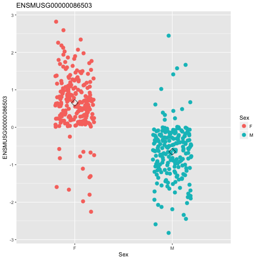
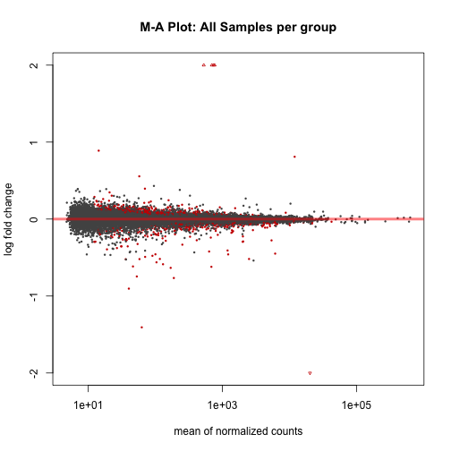
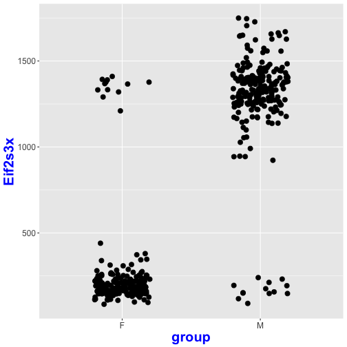

---
-   [Intro](#intro)
-   [QC Sample Mix ups](#qc-sample-mix-ups)
-   [DESeq2 Package](#deseq2-package)
-   [MA plot](#ma-plot)
-   [Plot counts](#plot-counts)
-   [Extract DE genes](#extract-de-genes)
-   [Gene ontology enrichment analysis](#gene-ontology-enrichment-analysis)
-   [Export to GeneWeaver](#geneWeaverExport)
---

 Intro
-----
One of the most common applications of RNA sequencing technology is to identify genes that are differentially expressed between sample groups, for example, between wild type and mutant, or between tumor and normal samples. Count data report the number of sequence reads (fragments) assigned to each gene, which describes the expression abundance of a gene. Similar data can be found in ChIP-Seq, HiC, shRNA screening, or mass spectrometry experiments.

 

We will be using Diversity Outbred Striatum IVSA dataset: 386 DO mice, males vs. females.

For a given gene, how would you compare expression between males and females?

 QC Sample Mix ups
-----------------

Let us make a plot.

 DESeq2 Package
--------------
  
  With low number of samples per group, the estimate of variance is not accurate. The solution is share information across the genes, i.e. Bayesian shrinkage.

For **DESeq2** we will need be using read counts at RNA level.

Let us filter out genes with zero and low expression (less than 5 read counts) in 50% of the samples.

~~~
[1] 1 3 5 7 8 9
~~~
{: .output}

~~~
[1] 20945   416
~~~
{: .output}

And apply DESeq2 package as follows:

summary of Differential Expression Analysis

~~~
summary(res)
~~~
{: .r}

~~~

out of 20945 with nonzero total read count
adjusted p-value < 0.1
LFC > 0 (up)     : 422, 2% 
LFC < 0 (down)   : 497, 2.4% 
outliers [1]     : 0, 0% 
low counts [2]   : 2031, 9.7% 
(mean count < 12)
[1] see 'cooksCutoff' argument of ?results
[2] see 'independentFiltering' argument of ?results
~~~
{: .output}

 MA plot
-------

In DESeq2, the function plotMA shows the log2 fold changes attributable to a given variable over the mean of normalized counts for all the samples in the DESeqDataSet. Points will be colored red if the adjusted p value is less than 0.1. Points which fall out of the window are plotted as open triangles pointing either up or down.

~~~
plotMA(res, main="M-A Plot: All Samples per group", ylim=c(-2,2))
~~~
{: .r}

 Plot counts
-----------

It can also be useful to examine the counts of reads for a single gene across the groups. A simple function for making this plot is plotCounts, which normalizes counts by sequencing depth and adds a pseudocount of 1/2 to allow for log scale plotting. The counts are grouped by the variables in intgroup, where more than one variable can be specified. Here we specify the gene which had the smallest p value from the results table created above. You can select the gene to plot by rowname or by numeric index.

~~~
ylab.nm <- "Eif2s3x"
d<-plotCounts(dds, gene=which.min(res$padj), intgroup="group",
              returnData=TRUE)
p <- ggplot(d, aes(x=group, y=count)) +
  geom_point(position=position_jitter(w=0.2,h=0),size=3)
p <- p + theme(axis.text=element_text(size=12),
               axis.title=element_text(size=20,face="bold", colour = "blue"),
               plot.title = element_text(size = rel(2))) + ylab(label = ylab.nm)
p
~~~
{: .r}

 Extract DE genes
----------------

We have identified 716 up-regulated and 789 down-regulated genes, respectively. Let us next extract these gene lists for future use.

We first order results by the smallest p value:

~~~
resOrdered <- res[order(res$pvalue),]
~~~
{: .r}

Extract all results

~~~
write.csv(as.data.frame(resOrdered), file="DO_FvM_deresults.csv")
~~~
{: .r}

Extract significant only results

~~~
resSig <- subset(resOrdered, padj < 0.1)
write.csv(as.data.frame(resSig), file="DO_FvM_deresults_sig0.1.csv")
~~~
{: .r}

 Gene ontology enrichment analysis
---------------------------------

We will use R/topGO for the purposes of enrichment analysis

~~~
Error in loadNamespace(name): there is no package called 'webshot'
~~~
{: .error}

 Export to GeneWeaver
-----------------------

Let us first subset the differential gene expression results. One containing up-regulated genes and the other down-regulated genes. We will create a batch upload file with two genesets, named UpReg_Sex_Specific_Genes_AddictionShortCourse2017 and DownReg_Sex_Specific_Genes_AddictionShortCourse2017

~~~
[1] TRUE
~~~
{: .output}
