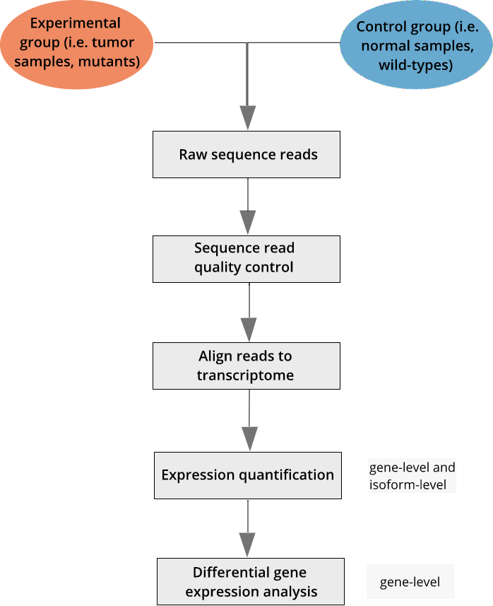

One of the most common applications of RNA sequencing technology is to identify genes that are differentially expressed between sample groups, for example, between wild type and mutant, or between tumor and normal samples. Count data report the number of sequence reads (fragments) assigned to each gene, which describes the expression abundance of a gene. Similar data can be found in ChIP-Seq, HiC, shRNA screening, or mass spectrometry experiments.

Once we have aligned sequence reads and have quantified expression, we can continue the pipeline with differential expression analysis. We will use read counts at the gene level and the R package [DESeq2](http://bioconductor.org/packages/release/bioc/html/DESeq2.html), among other packages. 
  
We will use quantified total liver gene expression data from 192 male and female Diversity Outbred (DO) mice ([Chick, J.M., et al. (2016) *Nature* 534(7608):500-505.])(https://www.nature.com/nature/journal/v534/n7608/abs/nature18270.html) Half of the animals were fed a standard rodent chow diet, and the other half fed a high-fat diet.

R Libraries and Data Import
------------------------------------
#### Load packages
Load the R libraries needed for the differential expression analysis.

~~~
library(DESeq2)
library(ggplot2)
library(dplyr)
library(tibble)
library(limma)
~~~
{: .r}

~~~

Attaching package: 'limma'
~~~
{: .output}

~~~
The following object is masked from 'package:DESeq2':

    plotMA
~~~
{: .output}

~~~
The following object is masked from 'package:BiocGenerics':

    plotMA
~~~
{: .output}

Check your working directory and set it if needed. Load the data files.

~~~
getwd()
~~~
{: .r}

~~~
[1] "/Users/smc/Projects/Lessons/ngs-lesson/_episodes_rmd"
~~~
{: .output}

#### Load gene information

Load the data file containing basic gene information used in the analysis.

~~~
gene_info <- read.csv(url("ftp://ftp.jax.org/dgatti/ShortCourse2015/ENSMUSG-gene-info-R84.tsv"),header=FALSE,sep="\t")
colnames(gene_info) <- c("gene_id", "gene_name", "chr", "strand", "start", "end")
head(gene_info)
~~~
{: .r}

~~~
             gene_id gene_name chr strand     start       end
1 ENSMUSG00000000001     Gnai3   3      - 108107280 108146146
2 ENSMUSG00000000003      Pbsn   X      -  77837901  77853623
3 ENSMUSG00000000028     Cdc45  16      -  18780447  18811987
4 ENSMUSG00000000031       H19   7      - 142575529 142578143
5 ENSMUSG00000000037     Scml2   X      + 161117193 161258213
6 ENSMUSG00000000049      Apoh  11      + 108343354 108414396
~~~
{: .output}

#### Load R Data files

Load the R data files containing expression data and experimental design information needed for doing  differential expression analysis.

~~~
load("../data/ChickMungeretal2016_DiversityOutbred.Rdata")
load("../data/DO192_RNAseq_EMASE_RawCounts.Rdata")
~~~
{: .r}

#### Explore the data
We loaded in several data objects. Look in the Environment pane to see what was loaded.  You should see objects containing annotations, covariates, and expression. In this episode we will work with expression and covariates for RNA data (i.e. `expr.rna.192.rawcounts`, `covariates.rna.192`), rather than protein data.

Click on the triangle to the left of `expr.rna.192.rawcounts` in the Environment pane to view its contents. Click on the name `expr.rna.192.rawcounts` to view the first several rows of raw read counts.

Let's look at the dimensions of the raw read counts.

~~~
dim(expr.rna.192.rawcounts)
dimnames(expr.rna.192.rawcounts)
~~~
{: .r}

The raw read count data has 192 rows representing samples, and 21122 columns of genes.

> ## Challenge 1 Explore the covariates  
> Explore the covariates for the RNA data.  
> 1). How many rows are there? How many columns?     
> 2). What variables are in the rows? the columns?     
>
> > ## Solution to Challenge 1
> > 1). `dim(covariates.rna.192)` 192 rows, 6 columns.  
> > 2). `dimnames(covariates.rna.192)` The sample IDs are in rows, and column variables include sex, diet, Sdinteraction, batch, generation, and coat color.    
> {: .solution}
{: .challenge}

#### Experimental design factors

Create a data frame containing key experimental design factors for this experiment. These factors include diet and sex.

~~~
# Transpose the raw read counts so that genes are in rows and sample IDs are in columns
exp_all <- t(expr.rna.192.rawcounts)

# Create a new data frame composed of sample IDs and covariate data for the experimental design
exp_design <- data.frame(Sample_ID = rownames(covariates.rna.192), covariates.rna.192, stringsAsFactors = FALSE)

# Take a quick look at these new data structures
head(exp_design)
exp_all[1:5,1:5]
exp_design[1:5,]
~~~
{: .r}

~~~
# Re-define the experimental design data by combining diet and sex along with sample ID
exp_design <- covariates.rna.192 %>% select(Diet, Sex) %>% rownames_to_column('Sample_ID')
~~~
{: .r}

~~~
Error in (function (classes, fdef, mtable) : unable to find an inherited method for function 'select' for signature '"data.frame"'
~~~
{: .error}

~~~
### print the first several rows of the experimental design
head(exp_design)
~~~
{: .r}

~~~
     Sample_ID Sex Diet Sdinteraction Batch   Gen Coat.Color
F326      F326   F chow             1     2 G11L1      black
F327      F327   F chow             1     2 G11L1      black
F328      F328   F chow             1     2 G11L1      white
F329      F329   F chow             1     2 G11L1     agouti
F330      F330   F chow             1     2 G11L1     agouti
F331      F331   F chow             1     2 G11L1      black
~~~
{: .output}

Check to make sure that the sample IDs in the raw read counts are in the same order as those in the experimental design file.

~~~
all(colnames(exp_all) == exp_design$sample_ID)
~~~
{: .r}

~~~
[1] TRUE
~~~
{: .output}

> ## Challenge 2 Familiarize yourself with the data
> 1). Find the number of samples in the data set.  
> 2). Find the number of genes in the study.  
>
> > ## Solution to Challenge 2
> > 1). 
> > 2).   
> {: .solution}
{: .challenge}

A quick check for sample mixup
------------------------------
Let's do a quick check for sample mixup with *Xist* gene expression. *Xist*, or X-inactive specific transcript, produces non-protein coding RNA. The gene is expressed exclusively from the inactivated X chromosome in female mice.  

~~~
### Xist ensembl ID
gene_id <- 'ENSMUSG00000086503'
~~~
{: .r}

Copy and paste the following function into the console. This function plots raw read counts by sex. It requires an experimental design file, gene expression data, gene IDs, and a variable to plot.

When you have successfully defined this function, you should see it in the Environment tab under Functions. The name of the function is `plot_exp`.

~~~
plot_exp <- function(exp_design, gexp, g_id, g_info, variable="Sex"){
      # plots gene expression (raw) counts by Sex variable
      # Arguments:
      #    exp_design: experimental design data frame containing
      #                sample IDs, Diet and Sex information           
      #    gexp:       gene expression data  
      #    g_id:       ensembl gene ID
      #    variable:   variable to plot
      # Output:
      #     gene expression plot 
      #
      if (g_id %in% rownames(gexp)){
        g_ind  <-  which(as.vector(g_info$gene_id)==g_id)
        g_name <- as.vector(g_info$gene_name)[g_ind]
        chro <- as.vector(g_info$chr)[g_ind]
        g_index <- which(rownames(gexp)==g_id)
        exp_data <- data.frame(exp_design, 
                     exp=as.numeric(gexp[g_index,]))
        if (variable=="Sex"){
            p <- ggplot(exp_data,aes(x=Sex, y=exp)) 
            p <- p + geom_point(position = position_jitter(width = 0.2),size=3,
                    aes(colour = Sex))
        }else{
            p <- ggplot(exp_data,aes(x=Diet,y=exp)) 
            p <- p + geom_point(position = position_jitter(width = 0.2),size=3,
                    aes(colour = Diet))
        }
        p <- p + stat_summary(fun.y=mean, geom="point", shape=5, size=4)
        p <- p + ylab("Gene Expression (Read Counts)")
        p <- p + theme(axis.text=element_text(size=12),
                axis.title=element_text(size=12,face="bold", 
                                        colour = "blue"),
                plot.title = element_text(size = rel(1.5)))
        p <- p + ggtitle(paste0(g_id,": ",g_name," Chr",chro))
        print(p)
      }else{
        print(paste0(gene_id, " not expressed"))
      }
}
~~~
{: .r}

Now that you have defined the plotting function, plot **Xist** expression in all samples against sex.

~~~
# plot Xist by sex
plot_exp(exp_design, exp_all, gene_id, gene_info)
~~~
{: .r}

~~~
# plot Xist by diet
plot_exp(exp_design, exp_all, gene_id, gene_info, variable="Diet")
~~~
{: .r}

~~~
# plot gene Rb1cc1 by sex
gene_id <- 'ENSMUSG00000025907'
plot_exp(exp_design, exp_all, gene_id, gene_info)
~~~
{: .r}

Female mice averaged 15,000 raw read counts for Xist, while males had none. We can rest assured that male and female samples weren’t mixed up.

> ## Challenge 3 Plot your favorite gene
> Pick your favorite gene (by ensembl ID) and plot its expression by:  
> 1). sex.    
> 2). diet.    
>
> > ## Solution to Challenge 3
> > 1). 
> > 2).   
> {: .solution}
{: .challenge}
  
Differential Expression Analysis with **three** samples in each group
------------------------------------------------------------------

Let us start with an example identifying the genes that are differentially expressed between the two diets. To make the example simple, we’ll subset the expression data such that we have 3 DO mice on the standard chow diet and 3 DO mice on the high fat diet. Later on we will see the effect of sample size by varying it.

Let us first get the sample IDs (mouse IDs).

~~~
head(exp_design)
exp_design

# filter out male mice on standard chow
male_chow_ids <- exp_design %>% filter(Sex=='M' & Diet=='chow') %>% pull(Sample_ID) 
male_chow_ids

# filter out male mice on high fat diet
male_hf_ids <- exp_design %>% filter(Sex=='M' & Diet=='HF') %>% pull(Sample_ID)
~~~
{: .r}

Set the sample size to 3.

~~~
sampleSize <- 3
~~~
{: .r}

Subset the data.

~~~
# create a list of mouse IDs with 3 males on chow and 3 on high fat
diet_3 <- c(male_chow_ids[1:sampleSize], male_hf_ids[1:sampleSize])

# create an experimental design file for the 6 animals
exp_design_diet_3 <- exp_design %>% filter(Sample_ID %in% diet_3)

# subset the raw read counts so that only gene expression for the 6 animals is represented
exp_diet_3 <- exp_all[, diet_3]

# check that the mouse IDs for the expression data and the experimental design file are in the same order
all(colnames(exp_diet_3) == as.vector(exp_design_diet_3$Sample_ID))
~~~
{: .r}

~~~
[1] TRUE
~~~
{: .output}

Take a quick look at the first several rows of expression data in the subset. Check its dimensions.

~~~
as.data.frame(head(exp_diet_3))
~~~
{: .r}

~~~
                        M326        M327      M328      M351      M352
ENSMUSG00000051951    2.0000    0.000000    0.0000    1.0000    1.0000
ENSMUSG00000025902   28.0000   30.000000   22.0000   29.0000   29.0000
ENSMUSG00000098104    0.0000    1.025781    0.0000    0.0000    0.0000
ENSMUSG00000033845  705.0000  634.006421  630.0000  455.9880  493.0000
ENSMUSG00000025903 2637.2729 2587.214344 2470.1066 1734.1035 2078.5513
ENSMUSG00000033813  978.4619 1108.673719  853.0824  652.5509  806.0604
                        M353
ENSMUSG00000051951    1.0000
ENSMUSG00000025902   40.0000
ENSMUSG00000098104    0.0000
ENSMUSG00000033845  570.9945
ENSMUSG00000025903 2393.5206
ENSMUSG00000033813  676.5410
~~~
{: .output}

~~~
dim(exp_diet_3)
~~~
{: .r}

~~~
[1] 21122     6
~~~
{: .output}

Filter out genes with zero and low expression.

~~~
threshold <- 200

# filter out genes with 200 or fewer read counts summed across all 6 animals
exp_mat_diet_3 <- as.data.frame(exp_diet_3) %>%
    rownames_to_column('gene_id') %>%
    filter(rowSums(.[,2:7], na.rm=TRUE) > threshold) %>%
    column_to_rownames('gene_id')

# how many genes are now represented?
dim(exp_mat_diet_3)
head(exp_mat_diet_3)
~~~
{: .r}
## Differential expression analysis with DESeq2

Let us create data frames for **DESeq2** object 

~~~
### colData contains the condition/group information for differential expression analysis
colData <- DataFrame(group = factor(exp_design_diet_3$Diet))
~~~
{: .r}

~~~
### Create DESeq2 object using expression and colData
dds_3reps <- DESeqDataSetFromMatrix(countData = as.data.frame(round(exp_mat_diet_3)),
         colData = colData, design = ~ group)
~~~
{: .r}

~~~
converting counts to integer mode
~~~
{: .output}

~~~
dds_3reps <- DESeq(dds_3reps)
~~~
{: .r}

~~~
estimating size factors
~~~
{: .output}

~~~
estimating dispersions
~~~
{: .output}

~~~
gene-wise dispersion estimates
~~~
{: .output}

~~~
mean-dispersion relationship
~~~
{: .output}

~~~
final dispersion estimates
~~~
{: .output}

~~~
fitting model and testing
~~~
{: .output}

~~~
res_3reps <- results(dds_3reps)
resOrdered_3reps <- res_3reps[order(res_3reps$padj),]
head(resOrdered_3reps)
~~~
{: .r}

~~~
log2 fold change (MLE): group HF vs chow 
Wald test p-value: group HF vs chow 
DataFrame with 6 rows and 6 columns
                    baseMean log2FoldChange     lfcSE      stat
                   <numeric>      <numeric> <numeric> <numeric>
ENSMUSG00000073940 315.30932       2.373692 0.2394648  9.912490
ENSMUSG00000031906 260.66920       4.267082 0.4355568  9.796842
ENSMUSG00000068037  90.69700       3.130446 0.3618463  8.651314
ENSMUSG00000071176 101.04051       2.402549 0.2852567  8.422413
ENSMUSG00000052305 832.10546       2.163156 0.2817990  7.676237
ENSMUSG00000005220  76.79766       4.457200 0.5914271  7.536347
                         pvalue         padj
                      <numeric>    <numeric>
ENSMUSG00000073940 3.673735e-23 4.093275e-19
ENSMUSG00000031906 1.161600e-22 6.471275e-19
ENSMUSG00000068037 5.090991e-18 1.890794e-14
ENSMUSG00000071176 3.688093e-17 1.027318e-13
ENSMUSG00000052305 1.638293e-14 3.650772e-11
ENSMUSG00000005220 4.833183e-14 8.975221e-11
~~~
{: .output}

DE Analysis summary with **3** samples per group 
-------------------------------------------------

~~~
### summary of Differential Expression analysis
summary(res_3reps)
~~~
{: .r}

~~~

out of 11188 with nonzero total read count
adjusted p-value < 0.1
LFC > 0 (up)     : 275, 2.5% 
LFC < 0 (down)   : 193, 1.7% 
outliers [1]     : 46, 0.41% 
low counts [2]   : 0, 0% 
(mean count < 32)
[1] see 'cooksCutoff' argument of ?results
[2] see 'independentFiltering' argument of ?results
~~~
{: .output}

~~~
sig_genes_3reps <- as.data.frame(res_3reps) %>% 
                  rownames_to_column('gene_id') %>%
                  filter(padj<0.1) %>% pull(gene_id)
length(sig_genes_3reps)
~~~
{: .r}

~~~
[1] 468
~~~
{: .output}

### P-value histogram

Let us plot the histogram of p-values. The p-value histogram is a good diagnostic test for the differential expression analysis.

~~~
hist(res_3reps$pvalue, breaks=100,col="grey", ylim=c(0,800), xlab="p-value", main="p-value histogram: 3 Samples per group")
~~~
{: .r}

### **Top** differentially expressed genes

~~~
### helper functions to get gene information for a gene
### plot DESEQ2 object
deseq_gene_exp_plot <- function(deseq_obj, g_id, g_info){
      # plots gene expression counts by group variable
      # used in DESEQ2 object
      #
      # Arguments:
      #    deseq_obj: DESEQ2 object
      #    g_id:      ensembl gene ID
      #    g_info:    gene information dataframe
      #
      # Output:
      #     gene expression plot 
      #
      g_ind <- which(as.vector(g_info$gene_id)==g_id)
      g_name <- as.vector(g_info$gene_name)[g_ind]
      chro <- as.vector(g_info$chr)[g_ind]
      data <- plotCounts(deseq_obj, gene=g_id, intgroup=c("group"), returnData=TRUE)
      p <- ggplot(data, aes(x=group, y=count, color=group))
      p <- p+ ggtitle(paste0(g_id,": ",g_name," Chr",chro))
      p <- p+ geom_point(position=position_jitter(width=.1,height=0), size=3)
      p <- p + theme(axis.text=element_text(size=12),              axis.title=element_text(size=20,face="bold", colour = "blue"), 
            plot.title = element_text(size=rel(1.5)))
      print(p)
}
~~~
{: .r}

~~~
#par(mfrow=c(2,3),las=1)
n=3
top_genes <- rownames(resOrdered_3reps[1:n,])
for (i in 1:length(top_genes)){
  g_id <- top_genes[i]
  deseq_gene_exp_plot(dds_3reps, g_id, gene_info)
}
~~~
{: .r}

Differential Expression Analysis with **ten** samples in each **diet** group
------------------------------------------------------------------

~~~
sampleSize <- 10
diet_10 <- c(male_chow_ids[1:sampleSize],male_hf_ids[1:sampleSize])
exp_design_diet_10 <- exp_design %>% filter(Sample_ID %in% diet_10)
head(exp_design_diet_10)
~~~
{: .r}

~~~
  Sample_ID Sex Diet Sdinteraction Batch   Gen Coat.Color
1      M326   M chow             3     2 G11L1      black
2      M327   M chow             3     2 G11L1     agouti
3      M328   M chow             3     2 G11L1     agouti
4      M329   M chow             3     2 G11L1     agouti
5      M330   M chow             3     2 G11L1     agouti
6      M331   M chow             3     2 G11L1      white
~~~
{: .output}

~~~
exp_diet_10 <- exp_all[,diet_10]
dim(exp_diet_10)
~~~
{: .r}

~~~
[1] 21122    20
~~~
{: .output}

~~~
head(exp_diet_10)
~~~
{: .r}

~~~
                        M326        M327      M328        M329      M330
ENSMUSG00000051951    2.0000    0.000000    0.0000    0.000000    0.0000
ENSMUSG00000025902   28.0000   30.000000   22.0000   19.000000   27.0000
ENSMUSG00000098104    0.0000    1.025781    0.0000    1.019187    0.0000
ENSMUSG00000033845  705.0000  634.006421  630.0000  626.000000  692.9662
ENSMUSG00000025903 2637.2729 2587.214344 2470.1066 2718.405256 2227.8115
ENSMUSG00000033813  978.4619 1108.673719  853.0824  958.614174 1122.8894
                          M331        M332      M333      M334        M335
ENSMUSG00000051951    2.000001    0.000000    0.0000    0.0000    0.000000
ENSMUSG00000025902   47.000000   36.000000   25.0000   33.0000   30.000000
ENSMUSG00000098104    1.028640    1.024341    0.0000    0.0000    1.035665
ENSMUSG00000033845  689.000000  654.007901  469.0000  671.9106  580.276460
ENSMUSG00000025903 2764.053805 2341.896904 1942.3996 2471.8835 2538.717853
ENSMUSG00000033813  908.940465  809.121005  661.0976 1196.1387 1066.312021
                        M351      M352      M353      M354      M355
ENSMUSG00000051951    1.0000    1.0000    1.0000    0.0000    2.0000
ENSMUSG00000025902   29.0000   29.0000   40.0000   14.0000   35.0000
ENSMUSG00000098104    0.0000    0.0000    0.0000    0.0000    0.0000
ENSMUSG00000033845  455.9880  493.0000  570.9945  375.0000  620.8904
ENSMUSG00000025903 1734.1035 2078.5513 2393.5206 1720.1728 2459.1403
ENSMUSG00000033813  652.5509  806.0604  676.5410  613.6654  735.8207
                        M356        M357      M358      M359      M360
ENSMUSG00000051951    3.0000    0.999999    0.0000    0.0000    1.0000
ENSMUSG00000025902   30.0000   36.000000   16.0000   31.0000   24.0000
ENSMUSG00000098104    0.0000    1.228979    0.0000    0.0000    0.0000
ENSMUSG00000033845  687.0000  530.000001  442.4729  566.9779  450.0000
ENSMUSG00000025903 2707.5965 2698.606475 2272.8827 2322.0693 1940.4030
ENSMUSG00000033813  825.2811  960.904946  758.7697  843.7344  759.9141
~~~
{: .output}

~~~
all(colnames(exp_diet_10)==as.vector(exp_design_diet_10$Sample_ID))
~~~
{: .r}

~~~
[1] TRUE
~~~
{: .output}

Let us filter out genes with zero and low expression (less than 5 read counts) in 50% of the samples.

~~~
threshold <- 2000
head(exp_diet_10)
dim(exp_diet_10)
exp_mat_diet_10 <- as.data.frame(exp_diet_10) %>%
    rownames_to_column('gene_id') %>%
    filter(rowSums(.[,2:ncol(exp_diet_10)+1], na.rm=TRUE) > threshold) %>%
    column_to_rownames('gene_id')
dim(exp_mat_diet_10)
head(exp_mat_diet_10)
~~~
{: .r}
Let us create data frames for DESeq2 object

~~~
### colData contains the condition/group information for Differenetial expression analysis
colData <- DataFrame(group = factor(exp_design_diet_10$Diet))
~~~
{: .r}

~~~
### Create DESeq2 object using expression and colData
dds_10reps <- DESeqDataSetFromMatrix(countData = as.data.frame(round(exp_mat_diet_10)),
         colData = colData, design = ~ group)
~~~
{: .r}

~~~
converting counts to integer mode
~~~
{: .output}

~~~
dds_10reps <- estimateSizeFactors(dds_10reps)
counts_10reps <- counts(dds_10reps, normalized=TRUE)
dds_10reps <- DESeq(dds_10reps)
~~~
{: .r}

~~~
using pre-existing size factors
~~~
{: .output}

~~~
estimating dispersions
~~~
{: .output}

~~~
gene-wise dispersion estimates
~~~
{: .output}

~~~
mean-dispersion relationship
~~~
{: .output}

~~~
final dispersion estimates
~~~
{: .output}

~~~
fitting model and testing
~~~
{: .output}

~~~
-- replacing outliers and refitting for 20 genes
-- DESeq argument 'minReplicatesForReplace' = 7 
-- original counts are preserved in counts(dds)
~~~
{: .output}

~~~
estimating dispersions
~~~
{: .output}

~~~
fitting model and testing
~~~
{: .output}

~~~
res_10reps <- results(dds_10reps)
resOrdered_10reps <- res_10reps[order(res_10reps$padj),]
head(resOrdered_10reps)
~~~
{: .r}

~~~
n=3
top_genes <- rownames(resOrdered_10reps[1:n,])
par(mfrow=c(2,3),las=1)
for (i in 1:length(top_genes)){
  g_id = top_genes[i]
  deseq_gene_exp_plot(dds_10reps, g_id, gene_info)
}
~~~
{: .r}

Differential Gene Expression Analysis Summary  
---------------------------------------------

### P-value histogram comparison

~~~
par(mfrow=c(1,2))
hist(res_10reps$pvalue, breaks=100, col="grey", xlab="p-value", ylim=c(0,1000), main="p-value histogram: 10 Samples per group")
hist(res_3reps$pvalue, breaks=100, ylim=c(0,1000), col="grey", xlab="p-value", main="p-value histogram: 3 Samples per group")
~~~
{: .r}

~~~
#rld_10reps <- rlog(dds_10reps, blind = FALSE)
#plotPCA(rld_10reps, intgroup = c("Diet"))
~~~
{: .r}

### DESEQ2 Summary: 3 samples per group

~~~
### summary of Differential Expression analysis
summary(res_3reps)
~~~
{: .r}

~~~

out of 11188 with nonzero total read count
adjusted p-value < 0.1
LFC > 0 (up)     : 275, 2.5% 
LFC < 0 (down)   : 193, 1.7% 
outliers [1]     : 46, 0.41% 
low counts [2]   : 0, 0% 
(mean count < 32)
[1] see 'cooksCutoff' argument of ?results
[2] see 'independentFiltering' argument of ?results
~~~
{: .output}

### DESEQ2 Summary: 10 samples per group

~~~
### summary of Differential Expression analysis
summary(res_10reps)
~~~
{: .r}

~~~

out of 8728 with nonzero total read count
adjusted p-value < 0.1
LFC > 0 (up)     : 496, 5.7% 
LFC < 0 (down)   : 406, 4.7% 
outliers [1]     : 0, 0% 
low counts [2]   : 0, 0% 
(mean count < 20)
[1] see 'cooksCutoff' argument of ?results
[2] see 'independentFiltering' argument of ?results
~~~
{: .output}

~~~
sig_genes_10reps <- as.data.frame(res_10reps) %>% 
                  rownames_to_column('gene_id') %>%
                  filter(padj<0.1) %>% pull(gene_id)
length(sig_genes_10reps)
~~~
{: .r}

~~~
[1] 902
~~~
{: .output}

~~~
length(union(sig_genes_10reps, sig_genes_3reps))
~~~
{: .r}

~~~
[1] 1237
~~~
{: .output}

~~~
length(intersect(sig_genes_10reps, sig_genes_3reps))
~~~
{: .r}

~~~
[1] 133
~~~
{: .output}

~~~
# Combining the two above..
comb <- unique(c(sig_genes_10reps, sig_genes_3reps))
length(comb)
~~~
{: .r}

~~~
[1] 1237
~~~
{: .output}

~~~
# Comparing comb with the above two
sig_genes_10reps_2 <- comb %in% sig_genes_10reps
sig_genes_3reps_2 <- comb %in% sig_genes_3reps

# Generating venn counts to plot venn diagram
sig_genes <- cbind(sig_genes_10reps_2, sig_genes_3reps_2)
head(sig_genes)
~~~
{: .r}

~~~
     sig_genes_10reps_2 sig_genes_3reps_2
[1,]               TRUE             FALSE
[2,]               TRUE             FALSE
[3,]               TRUE             FALSE
[4,]               TRUE             FALSE
[5,]               TRUE             FALSE
[6,]               TRUE              TRUE
~~~
{: .output}

~~~
sig_genes_counts <- vennCounts(sig_genes)

vennDiagram(sig_genes_counts, cex = 1,names = c("10 reps","3 reps"), circle.col = c("red", "blue"))
~~~
{: .r}

